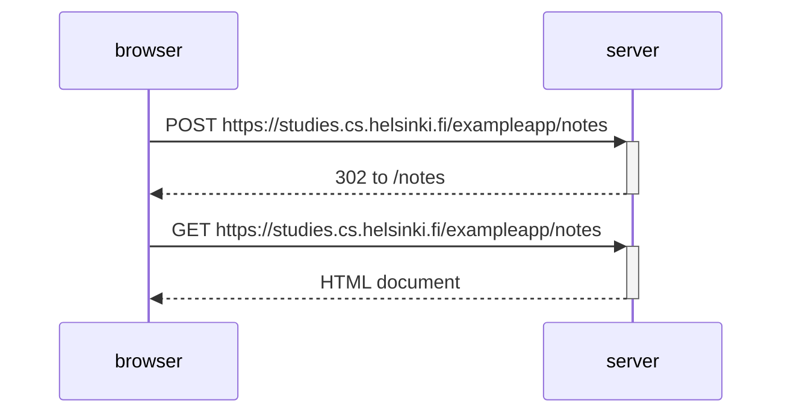

New note diagram

```mermaid
sequenceDiagram
		participant browser
		participant server
		
		%% user inputs data into form
		browser->>+server: POST https://studies.cs.helsinki.fi/exampleapp/notes
		%% server saves the note to database
		server-->>-browser: 302 to /notes
		browser->>+server: GET https://studies.cs.helsinki.fi/exampleapp/notes
		server-->>-browser: HTML document

```