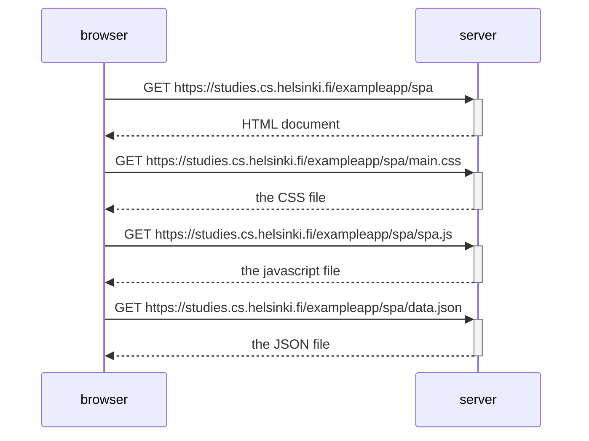

Single page app diagram

```mermaid
sequenceDiagram
	participant browser
	participant server
	
	browser->>+server: GET https://studies.cs.helsinki.fi/exampleapp/spa 
	server-->>-browser: HTML document
	browser->>+server: GET https://studies.cs.helsinki.fi/exampleapp/spa/main.css
	server-->>-browser: the CSS file
	browser->>+server: GET https://studies.cs.helsinki.fi/exampleapp/spa/spa.js
	server-->>-browser: the javascript file
	%% browser runs the javascript code and sends AJAX request for JSON
	browser->>+server: GET https://studies.cs.helsinki.fi/exampleapp/spa/data.json
	server-->>-browser: the JSON file
	%% browser renders the notes dynamically
```